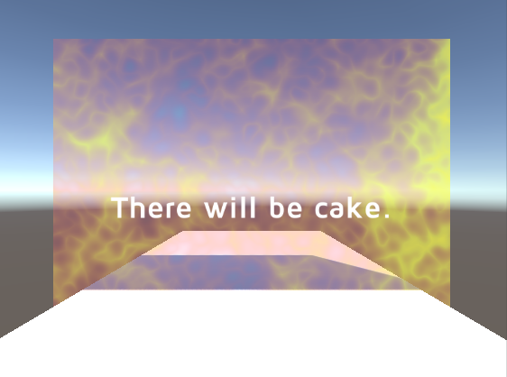

# Portal

A project to make a portal for use in VR. The noise textures uses jesta88's [Turbulence-Library](https://github.com/jesta88/Turbulence-Library) to generate a procedural energy effect. Using a first person controller, use the WASD keys to move towards the portal. It will disappear as you approach.

Included is a .zip application of the project for Mac.
